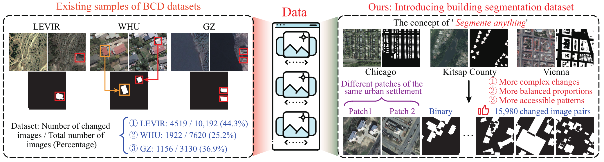
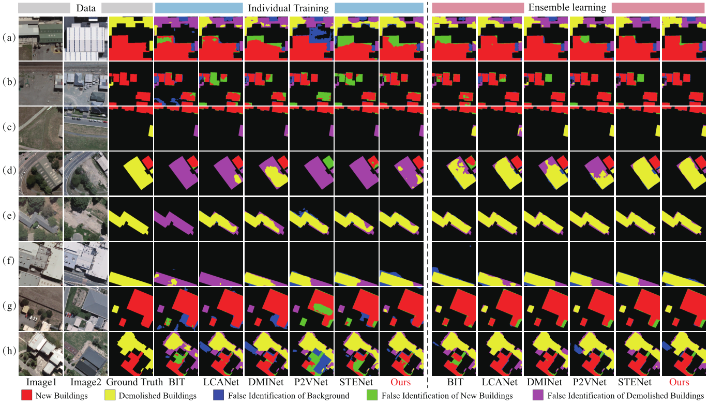

# Rethinking Semantic-level Building Change Detection: Ensemble Learning and Dynamic Interaction

Here, we provide the pytorch implementation of the paper: Rethinking Semantic-level Building Change Detection: Ensemble Learning and Dynamic Interaction.

* For binary-level BCD: 
[binary-level](https://github.com/fengyuchao97/DIELNet/tree/main/CD_for_binary)
* For semantic-level BCD:
[semantic-level](https://github.com/fengyuchao97/DIELNet/tree/main/CD_for_semantic)

Details can be seen in each branch.

Sample analysis of the available binary-level BCD datasets and the proposed method of constructing BCD samples through the BS dataset.

Task descriptions for BCD at the binary-level and at the semantic-level.

The independent training paradigm (left) and the proposed ensemble learning scheme (right) with multi-label and multi-task for BCD.

The overall architecture of dynamic interaction ensemble learning network (DIELNet).

Schematic diagram of our proposed frequency-swapped progressive generator (FSPG).

Examples presentation of available binary-level BCD samples and the proposed semantic-level BCD samples.

Sample distribution statistics for various datasets, where subplots (a), (d), and (g) present image-level distributions, subplots (b), (e), and (h) present percentage distributions of changed regions in each image, and subplots (c), (f), and (i) give the distributions of changed regions.

Sample distribution statistics for various datasets, where the left polar plot gives the distribution of binary-level changes, and the right subplots present the distribution of new buildings and demolitions, respectively.

The benchmark datasets used for experiments.

Comprehensive comparisons of efficiency and performance. The left figure is efficiency comparisons of binary-level BCD on Inria-CD. The right figure shows the numerical analysis of demolished regions on WHU.

Quantitative comparision of binary-level BCD on different datasets.

Binary-level visual results of different methods equipped with ensemble learning on representative samples of LEVIR+, WHU and GZ.

Quantitative comparision of semantic-level BCD on different datasets.

Semantic-level visual results of different methods with or without ensemble learning on representative samples of WHU.

Semantic-level visual results of different methods with ensemble learning on representative samples of LEVIR+ and GZ.

Comparison of GPU memory usage (bar) and inference time (line) under batch size 64 and spatial size 256 × 256.

## Cite
If you use our method in your work please cite our paper:
* BibTex：

    @ARTICLE{10034787,
      author={Feng, Yuchao and Jiang, Jiawei and Xu, Honghui and Zheng, Jianwei},
      journal={IEEE Transactions on Geoscience and Remote Sensing}, 
      title={Change Detection on Remote Sensing Images using Dual-branch Multi-level Inter-temporal Network}, 
      year={2023},
      volume={},
      number={},
      pages={1-1},
      doi={10.1109/TGRS.2023.3241257}
    }

    @ARTICLE{9759285,
      author={Feng, Yuchao and Xu, Honghui and Jiang, Jiawei and Liu, Hao and Zheng, Jianwei},
      journal={IEEE Transactions on Geoscience and Remote Sensing}, 
      title={ICIF-Net: Intra-Scale Cross-Interaction and Inter-Scale Feature Fusion Network for Bitemporal Remote Sensing Images Change Detection}, 
      year={2022},
      volume={60},
      number={},
      pages={1-13},
      doi={10.1109/TGRS.2022.3168331}
    }
    

* Plane Text：
	
    Y. Feng, J. Jiang, H. Xu and J. Zheng, "Change Detection on Remote Sensing Images using Dual-branch Multi-level Inter-temporal Network," in IEEE Transactions on Geoscience and Remote Sensing, doi: 10.1109/TGRS.2023.3241257.
    
    Y. Feng, H. Xu, J. Jiang, H. Liu and J. Zheng, "ICIF-Net: Intra-Scale Cross-Interaction and Inter-Scale Feature Fusion Network for Bitemporal Remote Sensing Images Change Detection," in IEEE Transactions on Geoscience and Remote Sensing, vol. 60, pp. 1-13, 2022, Art no. 4410213, doi: 10.1109/TGRS.2022.3168331.
    
    
    

